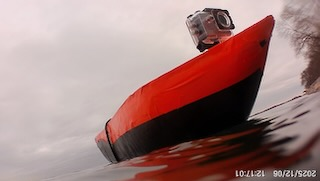

# BO-AT

The BO-AT Team

Need calibration to be done off the coast? ... etc

BO-ATs got you!

Click the image below to watch the demonstration:

## Project Description
The goal of this project is to develop an autonomous sailing research vessel for long-duration environmental monitoring missions. We're building a wind-powered platform with GPS waypoint navigation, partnering with Woods Hole Oceanographic Institution to deploy RF transmitters for NOAA weather radar calibration. 

Deliverables include: 
- An intermediate, motor driven vessel, prototype [COMPLETED 12/06/2025]

- Autonomous and manual control

- Vessel software, version-controlled in GitHub

- Web UI hosted on a public server

- Test results for weather radar calibration

## Team links
- [Team Google Drive](https://drive.google.com/drive/folders/1DOMSv3BQg_NJUjcH5m1vT1EV-Kz_XhOu?usp=sharing)

## Course links
- [ECE Senior Design Piazza Site](https://piazza.com/bu/fall2025/ec463/home)
- [Blackboard](http://learn.bu.edu/)

## Optional features links
- Team Jira
- Team Confluence
- Something else

